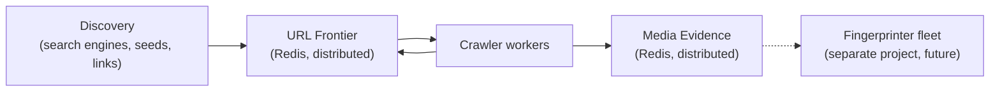

# Anti-Piracy Crawler

## Overview

The Anti-Piracy Crawler is a distributed discovery system that finds URLs
which may host or link to pirated media. It discovers candidate URLs from
search engines and seed lists, crawls them, extracts further links and any
media it observes on the page, and records that media as **evidence** — a
URL plus context and metadata — into a queue for a separate, future
fingerprinting system to identify.

This repository implements discovery and crawling, plus the storage and
distributed-coordination layer for that evidence. It does **not**
implement fingerprinting, media downloading, or piracy classification
itself — those are a separate project, described in
[Current Status](#current-status) below.

## Architecture



Production runs multiple crawler machines against one shared Redis
instance, which coordinates both the URL frontier and the media evidence
store across the fleet. Full details, including claim/lease/recovery
semantics and the Redis/SQLite boundary:
[`docs/architecture/system-architecture.md`](docs/architecture/system-architecture.md).

## Features

- Search-engine discovery across six engines (DuckDuckGo, Bing, Brave,
  Yandex, Ahmia, Torch), with query-aware link scoring and automatic
  backoff on blocked engines.
- Seven crawler engine implementations (async HTTP, plain HTTP, Tor,
  Playwright, Selenium, Scrapling, and a hybrid engine that escalates
  per-URL between them).
- A distributed, Redis-backed URL frontier: priority scheduling, per-domain
  rate limiting, atomic distributed claims, lease-based crash recovery,
  and retry/backoff — with an independent SQLite backend for local
  development.
- Media evidence recording: deterministic asset identity, observation
  history, manifest-variant capture, and a distributed fingerprint-job
  queue (claim/lease/retry/recovery, mirroring the frontier's model) for
  a future fingerprinting consumer.
- Domain blacklist filtering, media-URL classification, and trap/ad/
  adult-content heuristics.

## Production Architecture

```
crawler fleet (multiple machines running main.py)
        │
        ▼
   shared Redis  ──────────────┐
        │                      │
        ▼                      ▼
   URL frontier          Media Evidence
   (namespace: crawler)  (namespace: evidence)
        │                      │
        ▼                      ▼
   discovery + crawl     fingerprint-job queue
                                │
                                ▼
                    future fingerprinter fleet
                    (separate project, not in this repo)
```

## Installation

```bash
git clone <this-repository-url>
cd crawler
python3.12 -m venv env
source env/bin/activate
pip install -r requirements.txt
```

Redis is required for production/distributed mode; local development can
run entirely on SQLite with no external services. Full setup, including
Redis configuration and every real dependency:
[`docs/installation.md`](docs/installation.md).

## Configuration

Runtime configuration lives in `config.yaml` at the repository root —
crawler engine/concurrency, frontier backend and Redis settings, media
evidence backend and Redis settings, seed files, and search-engine
selection. Full structure and every field:
[`docs/installation.md`](docs/installation.md#configuration).

## Usage

```bash
# Crawl from configured seed files
python main.py

# Discover and crawl from a search query
python main.py --query "movie title"

# Query discovery only, restricted to surface-web engines
python main.py --query-only --surface-web --query "movie title"

# Pick a specific crawler engine
python main.py --crawler-engine playwright

# Resume a previous run from stored state
python main.py --unfinished

# Run until the frontier is genuinely empty, no page cap
python main.py --indefinite-run
```

Every CLI flag, verified against the current `argparse` definition, with
working examples: [`docs/installation.md`](docs/installation.md#running).

## Testing

```bash
pytest
```

Redis-dependent tests self-skip if no Redis is reachable; browser-crawler
tests require `RUN_BROWSER_CRAWLER_TESTS=1`. Benchmark scripts (throughput,
crash recovery, heartbeat endurance, domain-starvation, priority/rate-limit
behavior) live in `tests/benchmarks/` and are run manually, not via pytest:

```bash
python tests/benchmarks/frontier_benchmark.py --frontier redis --urls 10000 --workers 8
```

Full testing and benchmarking guide:
[`docs/development.md`](docs/development.md#how-to-run-tests) and
[`docs/benchmarks.md`](docs/benchmarks.md).

## Project Structure

```
main.py              CLI entry point
config.yaml           runtime configuration
core/                 orchestration, frontier, config
crawler/              7 crawler-engine implementations
discovery/            seed loading + search-engine discovery
search_engines/       6 search-engine scraping adapters
parsers/               link/media/manifest extraction
storage/               SQLite + Redis backends (URL DB, media evidence)
intelligence/          fetch-routing classifier
tor/                   Tor SOCKS proxy configuration
utils/                 URL utilities, logging
seeds/, datasets/      seed lists, domain blacklist
tests/                 pytest suite + tests/benchmarks/ (manual scripts)
docs/                  documentation (see below)
```

## Documentation

- [`docs/architecture/system-architecture.md`](docs/architecture/system-architecture.md) — the current system, end to end.
- [`docs/development.md`](docs/development.md) — repository structure, conventions, how to extend the crawler.
- [`docs/installation.md`](docs/installation.md) — setup, configuration reference, every CLI command.
- [`docs/benchmarks.md`](docs/benchmarks.md) — what's been measured about frontier/evidence performance and why.
- [`docs/architecture/frontier-adr.md`](docs/architecture/frontier-adr.md) — detailed frontier design.
- [`docs/architecture/media-evidence-redis-design.md`](docs/architecture/media-evidence-redis-design.md) — detailed Media Evidence design.
- [`docs/architecture/media-evidence-step1.md`](docs/architecture/media-evidence-step1.md) — Media Evidence Phase 1 implementation record.
- [`docs/architecture/history/`](docs/architecture/history/) — investigation and decision records (Redis/SQLite boundary, frontier performance, domain starvation, blacklist incident, and more), preserved for their reasoning and measurements.

## Current Status

- **Crawler (discovery, frontier, crawling, extraction):** implemented and
  validated, including the distributed Redis frontier with claim/lease/
  heartbeat/recovery.
- **Media Evidence Phase 1 (storage + distributed coordination):**
  implemented and validated.
- **Fingerprinting (DINOv2, pHash, audio, temporal verification,
  FFmpeg processing):** not implemented in this repository. It is a
  separate, not-yet-built project that will consume the fingerprint-job
  queue this repository produces.
- The complete anti-piracy pipeline (discovery → crawl → evidence →
  fingerprint match → confirmed-match feedback) is **not** finished —
  only the discovery/crawl/evidence portion exists today.

## Roadmap

- A separate fingerprinter project/environment implementing real media
  download and fingerprinting algorithms against the existing
  fingerprint-job queue.
- A consumer of the `confirmed_match` Redis event stream for domain-score
  feedback.
- The eligible-domain-index frontier scheduling redesign, if telemetry
  ever shows the current `domain_scan_limit` cutoff becoming a real
  constraint.

## Legal Notice

This project is intended for research and anti-piracy investigation
purposes only. Users must ensure all crawling activity complies with
applicable laws, website terms of service, and ethical research
guidelines.

## License

MIT License
