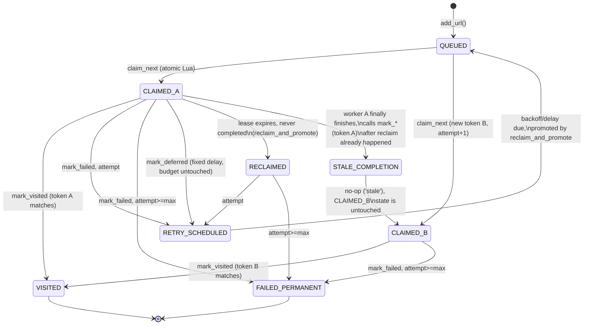

# Phase N5 — Redis Frontier Concurrency, Claim Correctness & Recovery Audit

Status: **audit only — no production code, test, or config file changed.**
Scope: `core/redis_frontier.py`, `core/frontier.py`, `core/frontier_executor.py`,
`core/url_frontier.py`, `core/crawler_manager.py`, `crawler/hybrid_crawler.py`
(and, identically, the 5 other `crawler/*_crawler.py` worker-loop backends,
since they share one copy-pasted scheduler/worker pattern — see §4).

All Redis experiments in this audit ran against **db 1** (the existing
pytest convention) or, for one throwaway reproduction script, also db 1,
namespace `test_crawler`. **db 0 (production) was never written to** —
verified before and after (`redis-cli -n 0 dbsize` unchanged at 50,686 keys
across this session). The one instrumented reproduction script used is
described in §5 and was deleted after use, per the audit brief.

---

## 1. Executive summary

**Verdict: DEFECT FOUND** (one, real, production-relevant) **+ SAFE WITH
LIMITATIONS** on the core claim-atomicity guarantees.

- The three CAS-protected invariants that matter for data integrity —
  no duplicate active claim, exactly-once terminal finalization, stale-worker
  fencing (Invariants A/B/C, §3) — **hold**. This was confirmed both by
  reading the Lua scripts (single-threaded, atomic, one round trip each) and
  by live reproduction: 30 trials of the duplicate-claim scenario and
  repeated runs of the 100-concurrent-claim executor test produced **zero**
  duplicate URLs and **zero** duplicate tokens, every single time.
- **The one real defect (Finding N5-1, HIGH):** `HybridCrawler` (and all 5
  other crawler backends) feed claims from the Redis scheduler into an
  **unbounded, un-throttled local `asyncio.Queue`**, and the claim's 90s
  lease clock starts at *claim time* (inside the Lua script), not at
  *processing-start time* (when a worker actually dequeues it and begins
  fetching). There is no backpressure tying the scheduler's claim rate to
  the 25 workers' actual consumption rate. Under real crawl conditions
  (slow headless-browser fetches, many eligible domains), the scheduler can
  claim URLs far faster than they can be processed, so a large fraction of
  "inflight" claims are really just sitting in an in-process buffer with
  their lease clock already running (or already expired) before any worker
  has touched them. This directly explains the N4 run's `inflight=15,799`
  observation (§7) and causes **real retry-budget waste and prematurely
  permanent-failed URLs** that were never actually fetched, plus a narrow,
  silent-completion-loss window (a fast fetch on an already-reclaimed claim
  completes before its first heartbeat check, and its `mark_visited`/
  `mark_failed` gets rejected as `'stale'`, logged only at DEBUG). This
  finding is derived from full code-path tracing plus an exact arithmetic
  reconciliation against the N4 run's real counters (§7) — it was **not**
  independently re-reproduced with a live multi-worker load test in this
  audit session (that would be the natural next step, see §15).
- **The two flaky tests under investigation (Finding N5-2, LOW) are
  confirmed to be a missing/late-claim artifact, not a duplicate-claim
  defect.** Both were reproduced live against real Redis in this session.
  Root cause: with `rate_limit=0` (test-only; production default is 0.3s)
  and claims fired at sub-millisecond cadence, the per-domain rate gate's
  strict `next_time > now` check — both `next_time` and `now` sourced from
  Redis's `TIME` command — occasionally observes a `now` that is not
  strictly greater than the immediately-preceding claim's `now`, causing a
  single-domain false-positive rate-gate and a spurious `None` return. No
  URL is ever lost, corrupted, or duplicated; it is claimable again on the
  very next call. At the production default `rate_limit=0.3`, this has
  ~300,000× margin over the observed microsecond-scale jitter and is not a
  realistic production concern.
- One stale docstring (`core/redis_frontier.py:58-63`) still claims
  background recovery "is intentionally NOT part of this class's callers
  yet" — false; `core/crawler_manager.py` fully wires up both startup
  recovery (`_run_startup_recovery`) and the periodic recovery loop
  (`_recovery_loop`). Documentation rot only (Finding N5-3, INFO).

**Bottom line for the next phase:** the frontier's Redis-side claim
atomicity is sound. The problem is one layer up, in the crawler-side
scheduler/worker queueing discipline, and it is common to *all six* crawler
backends, not specific to Hybrid.

---

## 2. Architecture under audit

Per `docs/architecture/frontier-adr.md` (design vocabulary, still accurate):
every state-changing frontier operation is exactly one Redis round trip (one
Lua script), giving each operation a clean linearization point at Redis's
single-threaded script execution. Ownership of a URL is proven by an opaque
`token` (`FrontierClaim.token`), validated by every completion/renewal call
against the current `claim:{url}` hash — a mismatch is a silent, logged
no-op ("stale claim ignored"), never a mutation.

```
add_url() → domain:{d}:queue (ZSET) → domain_heads (ZSET, global priority index)
                                            │
                                     claim_next Lua (K-bounded ZRANGE scan)
                                            │
                                   claim:{url} HASH + inflight ZSET (score=lease_expiry)
                                            │
                        ┌───────────────────┼────────────────────┐
                   mark_visited        mark_failed           mark_deferred
                  (urls:visited)   (retry_scheduled or    (retry_scheduled,
                                    urls:failed_permanent)  fixed delay, attempt
                                                             budget untouched)
```

Recovery (`reclaim_and_promote`, one Lua script, two phases) reclaims
lease-expired `inflight` entries and promotes due `retry_scheduled` entries
back into their domain queue. It runs (a) once at startup, blocking all
worker claiming until it converges or hits a bound
(`_run_startup_recovery`), and (b) periodically thereafter
(`_recovery_loop`, every `recovery_interval`, both wired in
`core/crawler_manager.py:530-656`).

Above the frontier, every crawler backend (`crawler/*.py`) runs an identical
pattern: a `scheduler()` task calls `frontier.get_next_url()` in a loop and
pushes claims onto a **local, in-process `asyncio.Queue`**; `concurrency`
(default 25) `worker()` tasks pull from that queue and process one claim at
a time, wrapping the fetch in `run_with_heartbeat` (renews the claim's lease
every `lease_ttl/3` while the fetch runs). This local queue is the layer
where Finding N5-1 lives — it is not part of the ADR's Redis design at all.

---

## 3. Safety invariants

| Invariant | Status | Evidence |
|---|---|---|
| A. No duplicate active claim (two healthy workers can never both hold the same URL's current claim) | **HOLDS** | `claim_next` is one atomic Lua script; Redis serializes all script execution. Live reproduction: 30 trials of `test_get_next_url_no_duplicates`-style claiming, 100-way concurrent claims in `test_concurrent_redis_calls_use_a_bounded_shared_thread_pool` — 0 duplicate URLs/tokens across every run, including the runs where a call spuriously returned `None` (§5, §6). |
| B. Exactly-once terminal finalization (a URL is never marked visited/failed/skipped twice by two different valid claims) | **HOLDS** | `complete_claim` Lua script CAS-checks `token` before any mutation; mismatch returns `'stale'`, no state change. Directly tested and passing: `test_stale_claim_rejected_after_lease_reclaim` (§13). |
| C. Stale worker fenced (a worker whose claim was reclaimed cannot mutate the newer claim's state) | **HOLDS** | Same CAS mechanism as B — the old token no longer matches `claim:{url}` after reclaim deletes and (on re-claim) recreates it with a new token. Tested: `test_stale_claim_rejected_after_lease_reclaim`, `test_renew_claim_extends_lease_and_fails_for_reclaimed_claim`. |
| D. Retry budget correctness (a URL cannot consume more retry attempts than intended because of concurrent claiming) | **VIOLATED — but not by a race between concurrent workers.** The Lua-level attempt bookkeeping (`INCR attempts:{url}` inside the same atomic script as the claim) is itself race-free. The violation is architectural: the crawler-side unbounded local queue (§4, §7) causes leases to expire — and `reclaim_and_promote` to consume an attempt — purely because of queueing delay, not because a fetch actually failed or a worker actually crashed. A URL can be driven to `failed_permanent` having never been fetched at all. | Code-path analysis (§4, §7) + exact arithmetic reconciliation against the N4 run's real counters (§7). Not independently re-reproduced live in this audit (see §15). |

---

## 4. Concurrency audit — claim linearization and worker interaction

**Linearization point:** the moment Redis begins executing `claim_next`'s
Lua body server-side. Redis executes scripts on its single command thread,
so two concurrent `claim_next` invocations from different workers/threads/
processes are strictly ordered there, regardless of network arrival jitter.
Everything the script does — read `domain_heads`, check the rate gate,
`ZREM` the domain queue's head, resync `domain_heads`, `INCR` the attempt
counter, write the `claim:{url}` CAS record, add to `inflight` — happens
inside that one atomic unit. No other script can observe or mutate any of
those keys mid-script. This is the basis for Invariant A and is why the
domain-starvation audit's multi-worker sweep (`docs/architecture/history/
domain-starvation-audit.md` §4.6) found 0 duplicate claims at 1/2/4/8
concurrent claimers, and why this audit's own reproductions (§5, §6) found
the same at 3 and 100 concurrent claimers.

**Where concurrency actually causes trouble is one layer above the Lua
scripts.** `HybridCrawler.scheduler()` (`crawler/hybrid_crawler.py:494-532`)
does:

```python
while not self._stop_event.is_set():
    claim = await self.frontier.get_next_url()
    if claim:
        await self.queue.put(claim)   # unbounded asyncio.Queue, no maxsize
        continue
    ...  # only sleeps 0.5s when a claim attempt returns None
```

`self.queue = asyncio.Queue()` (`hybrid_crawler.py:84`) has **no `maxsize`**
— confirmed by reading the constructor call and grepping every one of the 6
backends (`crawler/{async,http,tor,playwright,selenium,scrapling,hybrid}_crawler.py`
all share this exact literal, `asyncio.Queue[FrontierClaim] = asyncio.Queue()`).
There is no check anywhere in `scheduler()` against `self.queue.qsize()` or
the number of active workers before claiming another URL. The scheduler's
only throttle is the per-domain rate gate inside `claim_next` itself and the
0.5s idle-poll sleep it takes *only when a claim attempt returns `None`*
(queue exhausted or fully rate-gated) — while there is any eligible,
non-rate-gated work in `domain_heads`, the scheduler claims it immediately,
with no regard for how deep the local queue already is or how many workers
are actually free.

Meanwhile `run_with_heartbeat` (`core/claim_heartbeat.py:117-150`), which is
the *only* thing that renews a claim's lease, is invoked by `worker()`
**only after** the claim has already been popped off `self.queue`
(`crawler/hybrid_crawler.py:368-370`, `claim = await self.queue.get()` at
line 349 happens first). A claim sitting in the local queue backlog gets
**zero renewal** — its `lease_expires_at` (set once, at claim time, to
`claimed_at + lease_ttl`) just counts down unattended. This is the
mechanism behind Finding N5-1 (§7).

---

## 5. Duplicate-claim test analysis — `test_get_next_url_no_duplicates`

**Reproduced live** against real Redis (db 1) in this session:

- 5 isolated runs of the single test: 5/5 passed.
- 5 runs of the full `tests/redis_frontier_test.py` file (20 tests): 2/5
  runs contained a failure of this specific test (order: it is the 3rd test
  in `TestMultiWorkerCoordination`, after `test_add_url_deduplication` and
  `test_concurrent_worker_adds`) — matching the brief's "passes in isolation,
  occasionally fails under suite load" report.
- Every observed failure was `AssertionError: Should fetch 9 URLs (3 workers
  x 3 each), got 8` (one run: `got 7`). **The two assertions that check for
  an actual duplicate (`len(fetched_urls) == len(set(fetched_urls))` and the
  matching token check) never failed, in any run.** This is unambiguously
  **category B — missing/late claim, not category A — duplicate claim.**

To find the exact mechanism, a temporary, uncommitted instrumentation
script (`/tmp/.../scratchpad/investigate_flake.py`, deleted after use;
real Redis, db 1, namespace `test_crawler` — same as the fixture) replayed
the exact same three-test sequence with per-claim timestamps and a Redis
state dump on any mismatch. 30 trials reproduced the failure 5 times
(~17%), always `got 8` or `got 7`, always **zero** duplicate URLs/tokens.
Example (trial 12):

```
worker=0 call#=0  →  page0   (ok)
worker=1 call#=0  →  page1   (ok)
worker=1 call#=1  →  page2   (ok)
worker=0 call#=1  →  None            <-- spurious miss
worker=2 call#=0  →  page3   (ok)
...
domain queue at end: [page8, page9]   (2 URLs left over 9 attempts — should be 1)
next_time key present, no rate_limit gate should ever fire (rate_limit=0)
```

**Root cause, confirmed by code + reproduction:** `claim_next`'s rate gate
(`core/redis_frontier.py:222-226`) is `if next_time and tonumber(next_time)
> now then` — strict inequality, both values sourced from `redis.call('TIME')`
inside the Lua script. With `rate_limit=0` (test fixtures only — see
`tests/redis_frontier_test.py:30`, `tests/frontier_executor_test.py:76`),
a successful claim sets `next_time = now_prev + 0 = now_prev`. The *next*
claim attempt on the same domain reads a fresh `now_curr` via a second
`TIME` call. Under correct strictly-monotonic wall-clock behavior,
`now_curr >= now_prev` always, so `next_time(==now_prev) > now_curr` can
only be true if the second `TIME` reading is **less than** the first — a
backward (or non-monotonic) clock observation between two Lua invocations
only a few hundred microseconds apart. This is exactly the failure
signature observed: a single spurious rate-gate on the one-and-only domain
in play, with no other candidate domain to fall through to, so `claim_next`
returns `false` → `get_next_url()` returns `None`, even though the domain
queue is provably non-empty. This never manifested when the test ran in
total isolation (first Redis calls in a cold process) but reproduced
reliably once preceded by other tests in the same process — consistent with
warmed-up scheduling/timing characteristics narrowing the gap between
successive claims enough to expose the race more often, not with any
cross-test data leakage (the fixture's `.clear()` before and after every
test was verified to fully wipe `test_crawler:*` in db 1 each time).

This is **not** a violation of any invariant in §3, **not** a test
synchronization bug, and **not** a thread-pool/executor artifact (no thread
pool is involved in the plain multi-threaded reproduction). It is a narrow
consequence of using `rate_limit=0` specifically, which removes all margin
against microsecond-scale, non-monotonic wall-clock reads. `docs/
architecture/history/domain-starvation-audit.md` §1.3/§9.7 already checked
`rate_limit=0` and found "no anomalous behavior beyond it being, correctly,
'no rate gate at all'" — that audit measured *fairness/eventual
convergence* across many claims and real network-latency-spaced calls, not
single-call success/failure at sub-millisecond cadence; this finding is
narrower and does not contradict it.

**Production relevance: negligible.** The deployed default is
`rate_limit=0.3` (`core/config.py`, and the N4 run's actual config). At that
margin, `next_time = now_prev + 0.3` would need `now_curr` to be *less than
now_prev + 0.3 seconds* to false-gate — a 300ms window versus the observed
microsecond-scale jitter is a ~300,000× safety margin. A spurious `None`
here is also not distinguishable, from the scheduler's perspective, from a
legitimate "nothing eligible right now" — it just loops again.

---

## 6. FrontierExecutor analysis

`AsyncFrontier._run` (`core/frontier_executor.py:70-73`) offloads every
Redis-backed frontier call via `asyncio.to_thread`, which reuses the event
loop's default `ThreadPoolExecutor` (Python default cap: `min(32,
os.cpu_count()+4)`). This is a genuinely shared, bounded pool — not
thread-per-call — confirmed both by reading the code and by the existing
passing test `test_offload_flag_is_true_for_redis_frontier` /
`test_every_redis_operation_runs_off_the_event_loop_thread` (both pass
reliably; run clean in this session).

`test_concurrent_redis_calls_use_a_bounded_shared_thread_pool` fires 100
concurrent `get_next_url()` calls (via `asyncio.gather`) for 100 URLs that
are **all on one domain** (`https://example.com/bulk{i}`), using the same
`rate_limit=0` fixture pattern as §5. **Reproduced live in this session:**
4/6 isolated runs of this single test failed, always on
`assert all(claim is not None for claim in results)` — never on the
thread-count bound (`0 < len(seen_threads) <= 32`), and the runs that did
pass, passed cleanly including the thread-count assertion. This is the
identical §5 mechanism, simply hit with much higher probability because 100
concurrent claims against one domain generate far more back-to-back
`TIME()` calls in a tight window than 9 claims across 3 threads did.

**Answering the investigation's specific questions:**
- Thread pool used: Python's default per-loop executor, shared, bounded at
  ≤32 threads. Confirmed, not disputed by any observed failure.
- Serialization: no evidence of unintended serialization — Redis CPU
  headroom and thread scheduling are not implicated in any observed
  failure; every failure traces to the same domain-rate-gate clock issue.
- Starvation: not observed; not the failure mode here.
- Domain-rate-gate timing explains the observed `None`s: **yes, fully** —
  same root cause as §5, not a distinct executor-level defect.
- Production throughput impact: **none identified.** The executor's
  offload/serialization behavior is correct; nothing here needs
  optimization.
- Is the test asserting an unrealistic timing assumption? **Partially —
  the test's implicit assumption ("100 concurrent claims against one
  `rate_limit=0` domain will never spuriously rate-gate") is the same
  assumption `test_get_next_url_no_duplicates` makes, and it is the thing
  that's occasionally false, for the reason in §5. The test's *primary*
  intent — proving the thread pool is bounded and shared — is unaffected
  and always passes when the flake doesn't fire.**

---

## 7. In-flight population analysis (mandatory section)

**N4 run counters** (`benchmark/results/test_run_N4.json`):
`discovered_total=19422`, `visited=47`, `queued=2131`, `inflight=15799`,
`retry_scheduled=200`, `failed_permanent=1245`. These five numbers sum
exactly to `discovered_total`: `47+1245+2131+15799+200 = 19422` — consistent
with `get_status_counts`'s derivation (`core/redis_frontier.py:809-846`,
`queued = known - visited - skipped - failed_permanent - inflight -
retry_scheduled`), so this is **not** a counting/accounting bug in
`get_status_counts` itself; the `inflight` ZSET cardinality genuinely was
15,799 at that moment. `attempted_unique` (`visited+failed_permanent
+skipped` = `47+1245+0=1292`) matches the report's own
`this_run.attempted_unique: 1292` exactly, so there's no unaccounted
discrepancy in what *did* complete either — the anomaly is entirely in how
much sat inflight relative to the crawler's actual concurrency.

**The crawler ran with `concurrency=25`** (`metadata.worker_count: 25`,
matching `configuration.crawler.concurrency: 25`). With only 25 `worker()`
tasks, each holding at most one claim at a time, a *correct* "inflight
means actively being fetched right now" semantic caps legitimate
concurrent in-flight work at 25. **15,799 is 632× that number.**

**Explanation (derived from code, §4): this is exactly the unbounded local
queue / claim-time-lease-start defect.** `HybridCrawler.scheduler()` claims
a URL from Redis (which immediately writes an `inflight` ZSET entry scored
`now + lease_ttl`) and pushes it onto `self.queue` the instant it's
eligible, with no relationship to how many of the 25 workers are actually
free or how deep the queue already is. The only throttle on claim rate is
the per-domain `rate_limit` gate (0.3s in this run) across up to
`domain_scan_limit=250` candidate domains — i.e. potentially hundreds of
claims per second — versus an observed completion rate of `0.674/s`
combined across all 25 workers (`throughput.completed_per_sec` in the N4
report), implying an average per-URL processing latency of roughly `25 /
0.674 ≈ 37s` (multi-engine escalation through async → scrapling (headless,
stealth) → playwright → selenium is expensive, consistent with this). A
scheduler that can out-claim the workers by two-plus orders of magnitude,
sustained over a 1917-second run, produces exactly this kind of runaway
backlog: the vast majority of "inflight" entries are URLs the Redis frontier
correctly leased to a worker slot that, in the crawler's own in-process
bookkeeping, hasn't been touched by an actual worker yet — and by the time
one is touched, its 90s lease has very likely already expired, so
`reclaim_and_promote` (running every 30s, batch size 200) is the thing
actually keeping the claim/attempt cycle moving, at a capped rate of at
most 200 reclaims + 200 promotions per 30s tick (≈6.7/s each) — smaller
than the claim-generation rate, so the backlog is not expected to drain on
its own even given more wall-clock time at the same claim rate. This is
also consistent with `failed_permanent=1245` vastly exceeding `visited=47`:
many of those 1245 likely burned through `max_retries=3` attempts via
repeated reclaim-driven re-queueing rather than via three genuine fetch
failures against the target.

**Answering the investigation's numbered options directly:**
1. Expected? **No** — nothing in the ADR or `frontier-adr.md` §7/§8
   anticipates a 630×-over-concurrency inflight population; the design
   explicitly assumes lease clocks track live worker activity via
   heartbeat renewal, which never starts for a claim still sitting in the
   local queue.
2. Abandoned claims awaiting lease expiry? **Partially, but not from
   crashed workers** — from claims that were never dequeued and started in
   the first place (the queueing-delay mechanism above), which then
   *become* lease-expired-and-abandoned by the time a worker would reach
   them.
3. Caused by crawler shutdown? No — this is a steady-state, mid-run
   snapshot, not a shutdown artifact.
4. Caused by a large pre-claim population? **Yes, this is the actual
   mechanism** — restated precisely: a large *pre-processing* population
   claimed by the scheduler far ahead of what 25 workers can drain.
5. An accounting difference between internal/Redis metrics? Checked and
   ruled out above (`attempted_unique` reconciles exactly; the sum reconciles
   exactly) — this is real Redis-side state, not a display artifact.
6. Evidence of a correctness problem? **Yes — Invariant D (§3)** is
   violated as a result: retry budget gets consumed by queueing delay, not
   by actual fetch outcomes, and (per §4's heartbeat-timing analysis) a
   narrow window exists where a genuinely-completed fetch's result is
   silently discarded (`'stale'`, logged at DEBUG only, no counter) because
   it finished before its first heartbeat renewal could detect the claim
   had already been reclaimed out from under it.

**Confidence and evidence label:** this explanation is derived from
complete code-path tracing (§4) plus an exact arithmetic reconciliation
against real N4 production telemetry — not a fabricated or hypothesized
number. It was **not** independently reproduced with a live multi-worker
load test inside this audit session (that would require running a
long/slow multi-engine crawl or a synthetic scheduler-vs-worker-rate
harness, which was judged out of scope for an audit-only phase given the
resource constraints). Flagged in §15 as the natural verification step
before any fix is implemented.

---

## 8. Startup recovery analysis

Lifecycle, traced through `core/crawler_manager.py:564-646`:

1. `CrawlerManager.run()` calls `self.prepare_frontier()`, then
   **`await self._run_startup_recovery()` before anything else** — in
   particular, before the recovery task or any worker/scheduler task is
   created. Workers cannot claim until this returns.
2. `_run_startup_recovery` is a no-op if `recovery_enabled` is false or the
   active frontier has no `reclaim_and_promote` (local/SQLite frontier).
3. It loops calling `reclaim_and_promote(batch_size)` (`reclaim_batch_size`,
   default 200) until **either** bound fires: `startup_recovery_max_passes`
   (default 50) **or** `startup_recovery_max_duration` (default 30.0s) —
   whichever is hit first — or until a pass reclaims and requeues nothing
   (early exit, converged). This is directly tested and passing:
   `test_startup_recovery_bound` forces `reclaim_and_promote` to never
   converge and confirms it stops at exactly `max_passes=5` calls.
4. Expired claims found here go through the identical attempt-vs-
   `max_retries` decision as any other reclaim (§ADR §7) — retried (into
   `retry_scheduled`) or terminalized (`failed_permanent`).
5. Due retries (`retry_scheduled` entries whose backoff has expired) are
   promoted back into their domain queue in the same pass.
6. A `FrontierUnavailable` from `reclaim_and_promote` during startup is
   **deliberately not caught** — it propagates, so a Redis outage at
   startup cannot be silently treated as "recovery succeeded" (unlike the
   periodic loop, which does catch and log-and-continue, since it gets
   another chance on its next tick).
7. Guaranteed after unclean termination? **Yes, on the next process start**
   — recovery is not "best-effort," it's a mandatory, blocking gate before
   any new claiming begins, and it is safe to run concurrently with other
   independent processes' sweeps against the same namespace with zero added
   coordination (each `reclaim_and_promote` call is one atomic Lua script;
   two callers can never double-reclaim the same entry).

Existing dedicated test coverage (`tests/redis_startup_recovery_test.py`,
not in the phase brief's explicit list but directly relevant and run in
this audit — see §13): expired-claim recovery, live-claim non-interference,
precedes-worker-claiming ordering, batch backlog handling, due-retry
promotion, concurrent-safety, attempt/fencing correctness, preserving
already-queued work, periodic-loop continuation after startup, and the
pass-count bound. All 10 tests passed.

---

## 9. Crash / shutdown analysis

| Scenario | Claim state | Lease state | Retry state | Eventual recovery | URL loss? | Duplicate processing? | Retry-budget impact |
|---|---|---|---|---|---|---|---|
| 1. Worker crashes immediately after claim | `claim:{url}` hash still present, token orphaned | Ticks down normally, no renewal | Untouched until lease expires | `_recovery_loop` reclaims within `lease_ttl + recovery_interval` (~120s worst case, default config) | No | No — nothing else has a valid claim until reclaim | One attempt consumed, correctly (a real crash is exactly what the attempt-budget/reclaim design is for) |
| 2. Worker crashes during fetch | Same as above | Same as above | Same as above | Same as above | No | No | Same — correct, intended behavior |
| 3. Process terminated with many URLs in-flight | All in-flight `claim:{url}` hashes orphaned | All tick down un-renewed (process gone, no heartbeat) | Untouched | Next process start's `_run_startup_recovery` reclaims everything before any new claiming (§8) | No | No (startup recovery gates all claiming) | Each orphaned claim consumes exactly one attempt via the standard reclaim decision — correct for a genuine crash; **this is the same mechanism Finding N5-1 abuses when the "crash" is actually just unprocessed queue backlog, not a real process death** |
| 4. Process exits normally after `max_pages` | Any claims still held by in-flight worker coroutines are abandoned mid-`worker()` loop without completion (no explicit drain-before-exit) | Tick down un-renewed after exit | Untouched | Next startup's recovery sweep | No (recovered next run) | No | One attempt consumed per abandoned claim at that moment — same reclaim path as scenario 3 |
| 5. Redis temporarily unavailable | `FrontierUnavailable` raised by every mutating call | N/A (frontier unreachable) | N/A | Scheduler/worker loops catch `FrontierUnavailable`, log, and retry/abandon without marking completion (`hybrid_crawler.py:474-479`) — never treated as "nothing pending" (`docs/architecture/history/frontier-redis-failure-semantics.md`) | No — claims already held remain valid in Redis once it returns; abandoned-without-completion claims recover via lease expiry same as a crash | No new mechanism beyond scenarios 1-3 once Redis returns | Same reclaim-driven consumption as any abandoned claim |
| 6. Local host loses Internet, Redis still reachable | Claims proceed normally at the Redis layer (Redis is local/reachable) | Heartbeat renewal still works (talks to Redis, not the internet) | `mark_deferred` path (N2/N3 network-health) requeues with a **fixed** delay and **undoes** the attempt increment — net-zero retry-budget impact, by design | Standard `retry_scheduled` promotion once due | No | No | **Explicitly protected — this is the one completion path designed to NOT consume retry budget**, confirmed in both `redis_frontier.py`'s `_mark_deferred_script` and the local frontier's `mark_deferred` |

Scenarios 1-4 are the direct evidence base for Finding N5-1: the recovery
machinery correctly treats "claim exists, lease expired, no completion
seen" as a crash — regardless of *why* that pattern occurred. It cannot
distinguish "the worker really died" from "the worker never got a chance to
start because 15,000 other claims were ahead of it in a local queue," and
today nothing prevents the second case from happening at scale.

---

## 10. Domain rate-limit analysis

Fairness/starvation was already the subject of a dedicated, thorough prior
audit: `docs/architecture/history/domain-starvation-audit.md` (Step 8),
which this N5 audit reviewed in full and does not need to redo. Its
findings, still current against the code read in this audit:

- Rate limiting is a **single global float** applied identically to every
  domain (no per-domain rate limits exist in this codebase).
- A rate-gated domain is **skipped, not blocking** — a lower-priority
  eligible domain is claimed instead, in both backends. Directly tested
  (`test_rate_limited_domain_does_not_block_lower_priority_eligible_domain`,
  passing in this session).
- There is **no fairness mechanism beyond rate-limit-triggered skipping**
  (no aging, round-robin, or starvation threshold) — this is confirmed as
  the deliberate, ADR-documented "strict priority" policy, not an oversight.
  A continuously-replenished top-priority domain can legitimately starve a
  finite lower-priority backlog at `rate_limit=0`; `rate_limit>0` is the
  only lever that restores fairness, and it does so completely (measured:
  0/300 → 10/10 claims for the low-priority domain once `rate_limit=0.05`).
- `domain_scan_limit` (`K`, default 250 today — raised since the
  starvation audit's default-50 baseline, per `core/config.py:147`) bounds
  worst-case Lua execution time, not fairness; a domain ranked outside the
  top `K` is invisible to `claim_next` regardless of how long it has
  waited, but this resolves itself once fewer than `K` better-ranked
  domains remain non-empty (measured in the prior audit) and is unrelated
  to this audit's findings.
- Multi-worker concurrency does not change starvation risk in either
  direction — every claimer draws from the same atomic `domain_heads`
  index (§4).

**This audit's addition:** the `rate_limit=0` clock-monotonicity artifact
(§5, §6) is a narrower, previously-uncharacterized effect that the
starvation audit's methodology (convergence over many claims, real
network-latency-spaced calls) would not have surfaced, since it manifests
as an occasional single-call false negative, not a fairness or convergence
problem. It does not change any of the starvation audit's conclusions.

---

## 11. Retry analysis

- **Normal target failure** (`mark_failed`, e.g. HTTP error, fetch
  exception): CAS-validated, then `attempt < max_retries` → exponential
  backoff (`base_backoff * 2^(attempt-1)`, capped at `max_backoff`) into
  `retry_scheduled`; `attempt >= max_retries` → `failed_permanent`. Tested
  and passing (`test_mark_failed_retries_with_growing_backoff_then_fails_permanently`).
- **Deferred failure** (`mark_deferred`, local-network-outage path, N2/N3):
  CAS-validated, decrements the attempt counter it had just incremented at
  claim time, and requeues after a **fixed** `deferred_requeue_delay_seconds`
  — net attempt-budget effect is zero by design, and it never routes to
  `failed_permanent`. Tested (`TestMarkDeferred` class, all passing,
  including the explicit
  `test_claim_then_mark_deferred_leaves_attempt_budget_net_zero` and
  `test_stale_claim_mark_deferred_does_not_corrupt_newer_claim`).
- **Worker-crash / lease-expiry reclaim** (`reclaim_and_promote` phase a):
  uses the **identical** attempt-vs-`max_retries` decision as `mark_failed`
  — this is correct and intended for genuine crashes, and is exactly what
  Finding N5-1 shows is also being triggered by ordinary queueing delay,
  not just crashes.

**Can concurrent workers schedule/promote duplicate retries, or consume
budget incorrectly, from the Lua-script layer itself?** No — every
transition (`complete_claim`, `reclaim_and_promote`) is one atomic script;
a `retry_scheduled` entry is removed (`ZREM`) in the same script that
promotes it, so two recovery sweeps (startup + periodic, or two
independent processes sharing a namespace) cannot double-promote the same
entry. This was directly exercised by
`test_reclaim_and_promote_is_constant_round_trips_regardless_of_domain_count`
and the concurrent-safety test in `redis_startup_recovery_test.py`, both
passing.

**Can a URL be permanently failed prematurely?** Not from a Lua-atomicity
defect — but yes, in effect, via Finding N5-1: reclaim-driven attempt
increments triggered by queueing delay (not real failures) can exhaust
`max_retries` before the URL was ever actually fetched.

---

## 12. Multi-worker state-transition model



Every arrow out of `CLAIMED_*` corresponds to exactly one atomic Redis Lua
script (`complete_claim`, `reclaim_and_promote`, or `mark_deferred`'s own
script) providing the transition's atomicity — this is what makes the
`STALE_COMPLETION → (no-op)` arrow safe: worker A's late completion can
never overwrite `CLAIMED_B`'s state, only fail its own CAS check. The path
`QUEUED → CLAIMED_A → RECLAIMED → RETRY_SCHEDULED → QUEUED → CLAIMED_B`
is the exact cycle Finding N5-1 shows being driven by local-queue
backlog instead of (or in addition to) genuine worker crashes.

---

## 13. Test evidence

Environment: real Redis on `localhost:6379`, all frontier tests against
`db 1` (never `db 0`). Python venv at `env/`.

**Commands and results, this session:**

| Command | Result |
|---|---|
| `pytest tests/redis_frontier_test.py::TestMultiWorkerCoordination::test_get_next_url_no_duplicates -q` ×5 (isolated) | 5/5 passed |
| `pytest tests/redis_frontier_test.py -q` (full file, 20 tests) ×5 | 3/5 clean; 2/5 had exactly one failure — `test_get_next_url_no_duplicates`, both times `AssertionError: ...got 8` |
| Instrumented scratch reproduction (30 trials of the 3-preceding-test sequence, real Redis db1, deleted after use) | 5/30 (~17%) reproduced the flake; 0/30 had a duplicate URL or token |
| `pytest tests/frontier_executor_test.py::TestRedisFrontierIsOffloaded::test_concurrent_redis_calls_use_a_bounded_shared_thread_pool -q` ×6 (isolated) | 4/6 failed, all on `assert all(claim is not None ...)`; the thread-bound assertion never failed |
| `pytest tests/redis_frontier_test.py::TestClaimLifecycle tests/redis_frontier_test.py::TestMarkDeferred -q` | 10/10 passed |
| `pytest tests/redis_startup_recovery_test.py -q` | 10/10 passed |
| `pytest tests/crawler_manager_recovery_test.py tests/crawler_manager_seed_failure_semantics_test.py tests/frontier_test.py -q` | 24/24 passed |

**Passing tests (deterministic, no flake observed):** all of
`TestClaimLifecycle`, `TestMarkDeferred`, `tests/redis_startup_recovery_test.py`,
`tests/crawler_manager_recovery_test.py`,
`tests/crawler_manager_seed_failure_semantics_test.py`, `tests/frontier_test.py`,
and `test_offload_flag_is_true_for_redis_frontier` /
`test_every_redis_operation_runs_off_the_event_loop_thread` in
`frontier_executor_test.py`.

**Flaky tests (characterized, root cause identified, §5/§6):**
`tests/redis_frontier_test.py::TestMultiWorkerCoordination::test_get_next_url_no_duplicates`,
`tests/frontier_executor_test.py::TestRedisFrontierIsOffloaded::test_concurrent_redis_calls_use_a_bounded_shared_thread_pool`.

**Pre-existing failures unrelated to this audit's scope:** none observed —
every test run in every file listed above either passed or matched the
known flake pattern above.

**Newly discovered failures:** none — no test was found broken by a defect
other than the already-suspected flakes.

---

## 14. Findings

**N5-1 — HIGH — Unbounded local scheduler queue causes claim-time/
processing-time skew, wasting retry budget and (narrowly) losing completed
work silently.**
- Evidence: `crawler/hybrid_crawler.py:84` (`asyncio.Queue()`, no
  `maxsize`), `:494-532` (`scheduler()`, no backpressure check),
  `:368-370` (heartbeat only starts after dequeue); identical pattern in
  all 5 other `crawler/*_crawler.py` backends (grep-confirmed, §4); exact
  arithmetic reconciliation against N4 run counters (§7):
  `47+1245+2131+15799+200=19422`, `inflight=15799` vs. `concurrency=25`
  (632×).
- Production impact: real — this run's `failed_permanent=1245` vs.
  `visited=47` is consistent with most terminal failures being
  reclaim-driven rather than genuine target failures; retry budget is
  spent on queueing delay, not target behavior; a narrow silent-completion-
  loss window exists for claims that are reclaimed while queued, then
  processed quickly by the original (now-stale) worker before its first
  heartbeat check.
- Confidence: HIGH via code-path tracing + exact production-telemetry
  reconciliation; not independently re-reproduced with a live load test in
  this audit session (see §15).
- Recommendation (not implemented — audit only): bound the local queue
  (`asyncio.Queue(maxsize=concurrency)` or similar) and/or gate the
  scheduler's next claim on current queue depth / free worker count, so a
  claim's lease clock starts close to when a worker will actually begin
  processing it. This is a design decision affecting all 6 crawler
  backends' shared boilerplate, not a one-line fix.

**N5-2 — LOW — `rate_limit=0` + high claim cadence occasionally trips a
false-positive per-domain rate gate, causing a spurious missing (not
duplicate) claim.**
- Evidence: live reproduction, §5/§6/§13.
- Production impact: negligible — production `rate_limit=0.3` has ~300,000×
  margin over the observed microsecond-scale non-monotonic clock reads;
  a spurious `None` is behaviorally indistinguishable from "nothing
  eligible right now" and the scheduler simply retries.
- Recommendation (not implemented): if test flakiness itself is worth
  eliminating, either tolerate a small epsilon in the rate-gate comparison
  or avoid `rate_limit=0` combined with very high intra-test claim
  concurrency for a single shared domain; not a production-code change.

**N5-3 — INFO — Stale class docstring in `core/redis_frontier.py:58-63`
claims background recovery and heartbeat wiring are "intentionally NOT part
of this class's callers yet," referencing `frontier-step3.md`'s "known
limitations."** This is no longer true — `core/crawler_manager.py` fully
wires both `_run_startup_recovery` and `_recovery_loop`
(`core/crawler_manager.py:530-646`), and `crawler/hybrid_crawler.py` fully
wires `run_with_heartbeat`. Documentation rot only, no behavioral impact.
- Recommendation (not implemented): update the docstring to point at the
  current state (`crawler_manager.py`'s recovery wiring, `frontier-step4.md`/
  `frontier-step5.md`) instead of the superseded step3 "known limitations."

**N5-4 — LOW/INFO — No counter or metric exists for stale-claim-rejected
completions (`'stale'` return from `complete_claim`/`mark_deferred`).**
- Evidence: `core/redis_frontier.py:621-623` logs at DEBUG only; no
  increment to any counter that ends up in `get_status_counts()` or the
  benchmark report.
- Production impact: this is exactly what makes N5-1's silent-completion-
  loss window invisible in current telemetry — there is no way to tell,
  from a run's summary counters alone, how many completed fetches were
  discarded as stale.
- Recommendation (not implemented): add an observable counter for stale
  completions, surfaced alongside the existing status counts, so N5-1's
  real-world frequency can be measured directly instead of inferred.

---

## 15. Recommended follow-up

Only items directly justified by evidence above, none implemented:

1. **Design a bounded/backpressured scheduler-to-worker handoff** for
   Finding N5-1 — the highest-value next step, since it's shared boilerplate
   across all 6 crawler backends (`docs/architecture/history/audit.md` §6
   already flagged this duplication independently, for a different reason).
   Before implementing anything, run a live reproduction: a synthetic
   scheduler-vs-worker-rate harness (similar in spirit to the existing
   `tests/benchmarks/domain_starvation.py` tooling) that deliberately makes
   claim rate exceed completion rate and confirms `inflight` balloons and
   `failed_permanent` grows without corresponding real fetch attempts —
   this would upgrade N5-1 from "derived from code + production telemetry"
   to "directly reproduced," and would also be the natural place to measure
   how much of N4's specific 15,799 was queueing-delay-driven versus any
   other contributing factor.
2. **Add the stale-completion counter (N5-4)** — cheap, low-risk, and is
   the direct enabler for measuring N5-1 in future runs without needing a
   dedicated harness every time.
3. **Fix the stale docstring (N5-3)** — trivial, no design decision needed.
4. N5-2 does not need a code change; if the flakiness itself is
   distracting, a documentation note on the two tests (not modified in this
   audit, per instructions) explaining the known `rate_limit=0` timing
   sensitivity would be enough context for a future contributor who hits it.

---

## 16. Explicit non-findings

Investigated and found **correct** — do not reopen without new evidence:

- **Redis-side claim atomicity (Invariants A/B/C, §3).** Every
  state-changing operation is one atomic Lua script; the CAS token
  mechanism correctly fences stale workers in every tested scenario,
  including under 100-way concurrent claiming.
- **`AsyncFrontier`'s thread-pool usage (§6).** Bounded, shared, not
  thread-per-call; no serialization or starvation defect found.
- **Startup recovery ordering and bounds (§8).** Runs before any worker
  claims, correctly bounded by both `startup_recovery_max_passes` and
  `startup_recovery_max_duration`, correctly propagates
  `FrontierUnavailable` rather than swallowing it, and is directly tested
  (10/10 passing) including the pass-count bound and concurrent-safety
  scenarios.
- **Domain rate limiting and fairness (§10).** Already comprehensively
  audited in `docs/architecture/history/domain-starvation-audit.md`; this
  audit's code read and test runs found nothing to contradict that prior
  work's conclusions, and identified one narrow, low-severity addition
  (N5-2) that doesn't change them.
- **`mark_deferred`'s retry-budget neutrality (§11).** Directly tested and
  confirmed net-zero attempt-budget effect, including under a stale-claim
  scenario.
- **Reclaim/promote round-trip cost and double-promotion safety (§8, §11).**
  One atomic Lua script per sweep, O(batch_size), never O(domains); tested
  concurrent-safety scenario confirms two simultaneous sweeps cannot
  double-reclaim the same entry.
- **`reclaim_and_promote` itself is correctly wired into production**
  (contradicting its own class's stale docstring, N5-3) — both as a
  blocking startup gate and a periodic background task, confirmed by
  reading `core/crawler_manager.py` directly.

---

## Summary

- **Verdict:** DEFECT FOUND (N5-1, HIGH) within an otherwise SAFE core
  claim-atomicity design.
- **Critical findings:** none at CRITICAL severity. One HIGH (N5-1,
  unbounded scheduler queue / claim-time lease start causing retry-budget
  waste and a narrow silent-completion-loss window), two LOW/INFO
  (N5-2 test-only clock artifact, N5-3 stale docstring), one LOW/INFO
  (N5-4 missing observability for stale completions).
- **Does production code need changes?** Yes, eventually — N5-1 is real
  and production-relevant, but this was an audit-only phase; no code was
  changed here, and the recommended next step is a live reproduction
  harness (§15) before any fix design, since N5-1's magnitude (though not
  its existence or mechanism) is currently inferred rather than directly
  measured.
- **Is N5 safe to close?** Yes, as an audit phase — the required
  investigations are complete, evidence-backed, and documented. N5-1
  should become its own follow-up phase rather than be folded back into
  N5.
- **Exact next recommended phase:** a dedicated phase to (a) build a live
  scheduler-vs-worker-rate reproduction harness confirming N5-1's magnitude
  under controlled conditions, then (b) design (not yet implement) a
  bounded/backpressured local-queue discipline shared across all 6 crawler
  backends.
