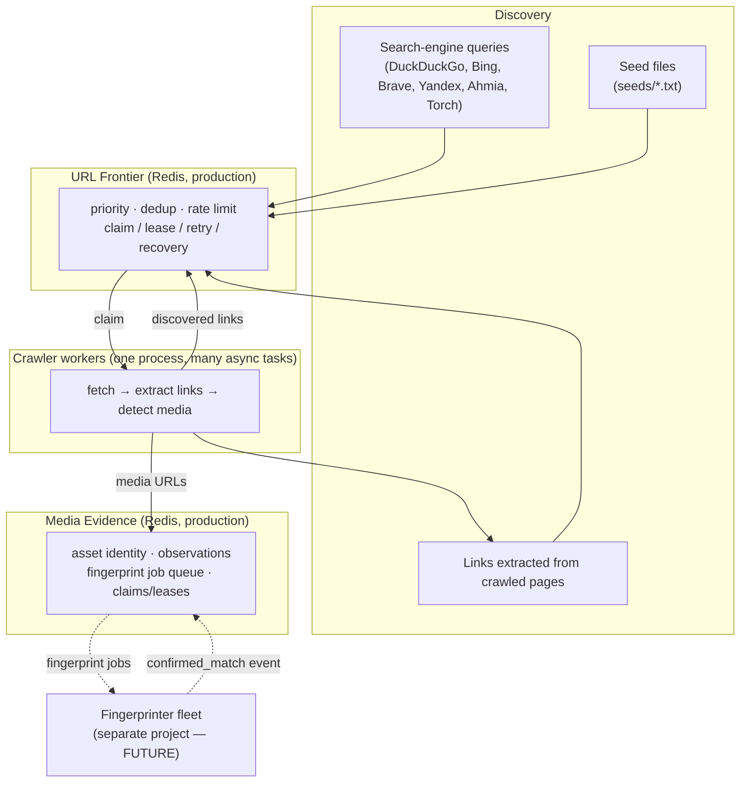
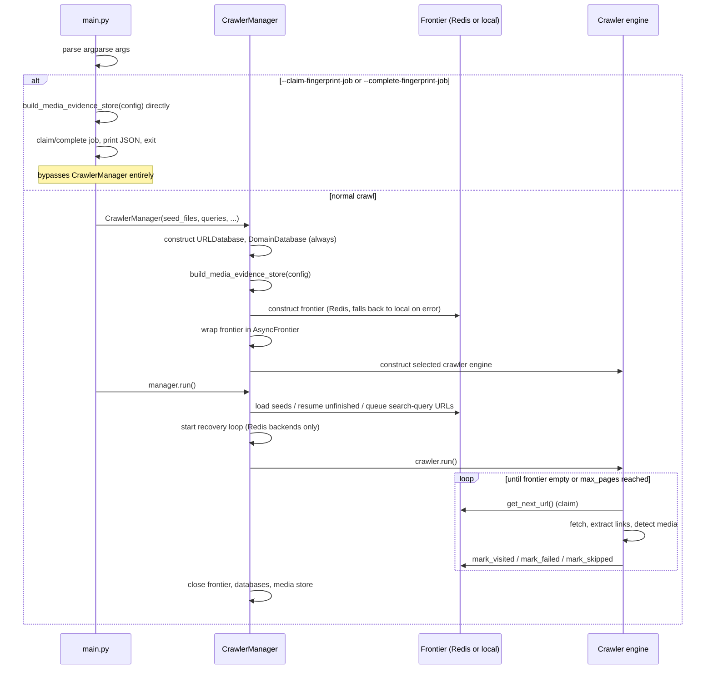
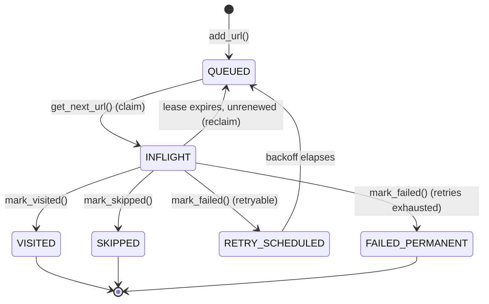
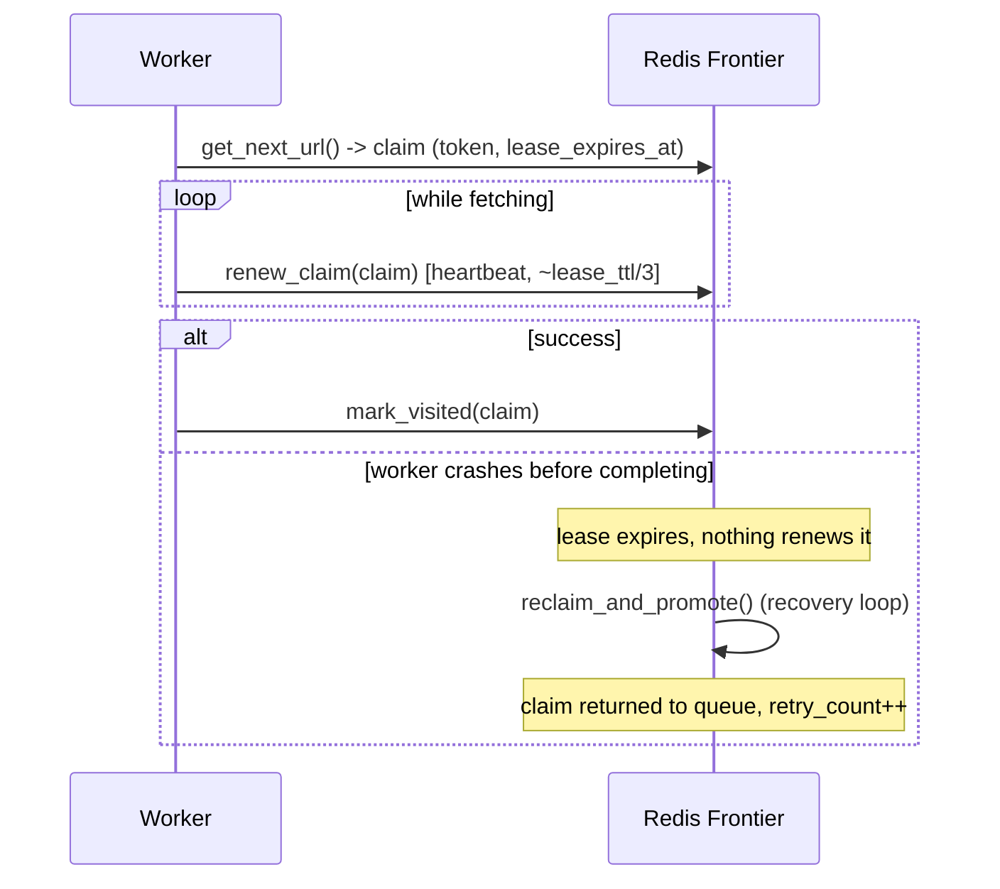
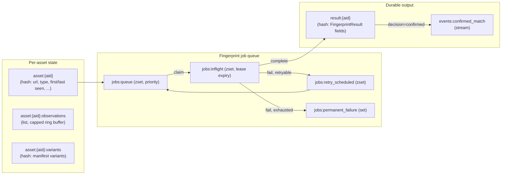

# System Architecture

> Describes the crawler as it exists today. For *how* the current design was
> reached, see the historical records linked from each section and the index
> in [`docs/architecture/history/`](history/). For the detailed frontier
> design vocabulary, see [`frontier-adr.md`](frontier-adr.md). For the
> detailed Media Evidence design, see
> [`media-evidence-redis-design.md`](media-evidence-redis-design.md) and its
> implementation records, [`media-evidence-step1.md`](media-evidence-step1.md)
> (storage/coordination) and
> [`history/media-evidence-step2.md`](history/media-evidence-step2.md) (async
> execution boundary).

Every capability below is tagged:

- **IMPLEMENTED** — exists in the current codebase, has tests.
- **DEFERRED** — designed, evaluated, deliberately not built (a documented decision, not an oversight).
- **FUTURE** — belongs to a separate, not-yet-built project or phase.

---

## 1. Project purpose

The Anti-Piracy Crawler is a distributed discovery system. It finds URLs
that may host or link to pirated media (via search-engine queries, seed
lists, and link extraction from crawled pages), fetches those pages, and
records any media files it observes as **evidence** — a URL, its context,
and metadata — for a separate, future fingerprinting system to later
identify.

The crawler **does not** fingerprint, download, or classify media content
itself. It discovers and records; a separate project consumes what it
records. **FUTURE**.

## 2. High-level architecture



Production deployment runs **multiple crawler machines against one shared
Redis instance**. Redis is the coordination point: it is what makes the
crawler fleet distributed rather than N independent single-machine
crawlers. See [§13](#13-redis-distributed-coordination) and
[§15](#15-redissqlite-boundary).

## 3. Crawler execution flow

Entry point: `main.py`. **IMPLEMENTED.**



Two independent things share `main.py`:

1. **Normal crawl mode** — builds a full `CrawlerManager` (frontier +
   discovery + crawler engine + media evidence) and runs it.
2. **Fingerprint-job CLI mode** (`--claim-fingerprint-job` /
   `--complete-fingerprint-job`) — talks to the media evidence store
   directly via the module-level `build_media_evidence_store(config)`
   function, without constructing a frontier, discovery pipeline, or
   crawler engine at all. This is a thin operational tool for manually
   exercising the fingerprint-job queue (e.g. during development of the
   separate fingerprinter project) — it is **not** the fingerprinter
   itself.

## 4. CLI / configuration flow

`main.py` reads CLI flags and `config.yaml`. CLI flags override config
where they overlap (crawler engine, media backend, page cap). See
[`docs/installation.md`](../installation.md) for the full flag reference
and [`docs/development.md`](../development.md) for the config object model
(`core/config.py`: `Config → CrawlerConfig → {StorageConfig, FrontierConfig,
MediaEvidenceConfig}`, plus `SearchConfig`).

## 5. Search-engine discovery

**IMPLEMENTED.** `discovery/search_engine_discovery.py` orchestrates six
real search-engine adapters in `search_engines/`, all implementing
`BaseSearchEngine` (`search_engines/base.py`): DuckDuckGo, Bing, Brave,
Yandex, Ahmia, Torch. Each does genuine HTML scraping against the engine's
result page (no API keys, no headless browser) — none are stubs.

`--surface-web` restricts discovery to DuckDuckGo, Bing, Brave, Yandex.
`--dark-web` restricts it to Ahmia, Torch. With neither flag, all engines
enabled in `config.yaml`'s `search.enabled_engines` run.

Discovered URLs are scored before entering the frontier
(`score_discovered_url`): `.onion` URLs and dark-web-engine results get a
priority boost (`search.engine_priorities`, `onion_priority_boost`).
Engines that return repeated blocked responses (e.g. a Yandex captcha) are
temporarily backed off for the rest of the query batch rather than retried
on every query (`blocked_engine_cooldown_queries`).

## 6. Seed handling

**IMPLEMENTED**, partially populated. `discovery/piracy_site_seeds.py`
(`load_seeds`) reads the files listed in `config.yaml`'s
`crawler.seed_files`. Of the five seed files in `seeds/`, only
`piracy_sites.txt` currently has content (51 URLs, ~50 distinct domains —
this number is directly load-bearing for the frontier's
`domain_scan_limit`, see [§10](#10-url-prioritization)).
`torrent_sites.txt`, `streaming_sites.txt`, `darkweb_seeds.txt`, and
`file_hosts.txt` are currently empty.

`--query-only` skips seed files entirely and starts from search-engine
discovery only. `--unfinished` resumes previously queued/pending URLs from
storage and skips both seeds and fresh discovery.

## 7. Frontier architecture

**IMPLEMENTED.** The frontier is the single most important subsystem in
the crawler — it owns URL deduplication, priority, domain politeness, and
distributed work coordination. Full design vocabulary and Redis keyspace
rationale: [`frontier-adr.md`](frontier-adr.md).

Both backends implement one `Frontier` protocol (`core/frontier.py`):

```python
class Frontier(Protocol):
    def add_url(self, url, priority=10, source_query="") -> bool: ...
    def get_next_url(self) -> FrontierClaim | None: ...
    def renew_claim(self, claim) -> FrontierClaim | None: ...
    def mark_visited(self, claim) -> None: ...
    def mark_failed(self, claim, error="") -> None: ...
    def mark_skipped(self, claim) -> None: ...
    def has_pending(self) -> bool: ...
    def pending_count(self) -> int: ...
    def get_source_query(self, url) -> str: ...
    def get_status_counts(self) -> dict[str, int]: ...
    def clear(self) -> None: ...
    def close(self) -> None: ...
```

Every crawl attempt is represented by a `FrontierClaim` (url, token,
attempt, domain, priority, `lease_expires_at`, `source_query`) — the token
proves ownership; nothing else can complete or renew that claim.



**Backends:**

- **`RedisURLFrontier`** (`core/redis_frontier.py`) — the production,
  distributed backend. Every state-changing operation is one Redis round
  trip via a Lua script (`add_url`, `claim_next`, `complete_claim`,
  `renew_claim`, `reclaim_and_promote`), so claim/complete/renew are
  atomic even with many machines sharing the same Redis instance. All
  timestamps are computed from Redis's own `TIME` command, never client
  clocks. Scheduling is strict global priority
  (`priority * 1_000_000 + sequence`) with per-domain queues and a
  per-domain rate-limit gate.
- **`URLFrontier`** (`core/url_frontier.py`) — the local/single-machine
  backend, an in-process `heapq` + per-domain deques. Used for `--sql`
  mode and for local development. Claim completion is always synchronous
  within one process, so there is no crash-recovery scenario to design
  for here.

`AsyncFrontier` (`core/frontier_executor.py`) wraps whichever backend is
active: calls against the local backend run inline (no offload overhead);
calls against Redis are offloaded via `asyncio.to_thread` so the
synchronous `redis-py` client never blocks the event loop. This wrapper is
what every crawler engine actually holds a reference to.

## 8. Worker architecture

**IMPLEMENTED.** `CrawlerManager` (`core/crawler_manager.py`) is the
top-level orchestrator: it owns the frontier, the databases, the media
evidence store, and the selected crawler engine, and runs the recovery
loop. There is no separate scheduler/worker-pool layer in the running
system — `core/scheduler.py` and `core/worker_pool.py` exist as files but
have zero callers (dead code, kept for historical reference only; see
[§25](#25-current-limitations)).

Each crawler engine (`crawler/*.py`) runs its own bounded pool of asyncio
tasks (`crawler.concurrency` in config), each looping: claim a URL from
the frontier, fetch, extract, mark the outcome. Long-running fetches are
wrapped in `run_with_heartbeat` (`core/claim_heartbeat.py`,
[§14](#14-claim--lease--heartbeat--recovery)) so a slow page doesn't lose its
claim to lease expiry.

## 9. Fetcher / extractor architecture

**IMPLEMENTED.** Seven independent crawler-engine classes in `crawler/`,
each a standalone implementation (no shared base class):
`AsyncCrawler`, `HTTPCrawler`, `HybridCrawler`, `PlaywrightCrawler`,
`ScraplingCrawler`, `SeleniumCrawler`, `TorCrawler`. Selected via
`crawler.engine` in config or `--crawler-engine` on the CLI: `auto` (→
`HybridCrawler`, the default), `async`, `http`, `tor`, `playwright`,
`selenium`, `scrapling`.

`HybridCrawler` uses `core/crawler_router.py` (`CrawlerRouter`) to escalate
a given URL through progressively heavier fetch strategies (e.g. plain
HTTP → a browser engine) based on heuristics including
`intelligence/piracy_domain_classifier.py`'s `PiracyDomainClassifier` — this
classifier affects **only which fetch engine is tried**, never frontier
scheduling priority.

Extraction, after a successful fetch:

- `parsers/html_link_extractor.py` (`HTMLLinkExtractor`) — outbound links,
  filtered to stay same-site plus a small number of strongly relevant
  cross-domain targets, to prevent queue explosion from ad/profile/blog
  links.
- `parsers/media_link_detector.py` (`MediaLinkDetector`) — scans
  `<a>`/`<video>`/`<audio>`/`<iframe>`/`<embed>`/`<source>` tags plus
  script/text content for media URLs.
- `parsers/streaming_manifest_parser.py` (`StreamingManifestParser`) —
  parses HLS/DASH manifests into variant streams.
- `parsers/javascript_link_extractor.py` (`JavaScriptLinkExtractor`) —
  links embedded in inline/external JS.

Media URLs detected here are what gets recorded into Media Evidence
([§16](#16-media-evidence-architecture)) — the crawler's extraction layer
is the only source of evidence input; there is no separate media-crawling
pass.

## 10. URL prioritization

**IMPLEMENTED.** Priority is a plain integer; lower is crawled first.
Discovery scoring (`score_discovered_url`,
[§5](#5-search-engine-discovery)) and in-page link scoring
(`URLUtils.get_link_priority`, boosts links matching the originating search
query) both feed into the priority value passed to `add_url`.

On the Redis backend, scheduling across domains is bounded by
`domain_scan_limit` — the number of domains `claim_next` will look across
per attempt. This is a **hard visibility cutoff**: a domain outside the
top-K is not examined at all, no matter how long its work has waited. The
current value is **250** (`config.yaml`, `core/config.py`'s
`FrontierConfig` default, and `RedisURLFrontier`'s own constructor default
all agree). It was raised from an original default of 50 because the seed
set alone spans ~50 domains and production runs multiple crawler machines
sharing one frontier, so headroom needs to hold fleet-wide. A read-only
diagnostic, `RedisURLFrontier.get_domain_scan_telemetry()`, reports
`active_domains` and whether the limit is currently being approached — a
`CrawlerManager` background sample logs a warning if so. The full
reasoning and rejected alternatives (adaptive K, a separate
eligible/gated index) are in
[`history/domain-scan-limit-decision.md`](history/domain-scan-limit-decision.md)
and [`history/domain-scan-window-design.md`](history/domain-scan-window-design.md).
**DEFERRED**: an eligible-domain index that removes the cutoff entirely is
fully designed but not built — intentionally, pending telemetry showing
250 is no longer enough.

## 11. Rate limiting

**IMPLEMENTED**, per-domain, not global. Each domain has a
next-allowed-time gate (`{ns}:domain:{domain}:next_time` on Redis); a
claim attempt against a domain still inside its gate is **skipped, not
blocked** — the frontier moves on to the next eligible domain rather than
stalling a worker. `crawler.rate_limit` in config sets the default
interval (`config.yaml` currently ships `0.3`s). `core/rate_limiter.py`
(`RateLimiter`, `aiolimiter`-based) exists in the tree but has zero
callers — rate limiting is enforced entirely inside the frontier, not by a
separate limiter component.

Rate limiting is also what prevents **domain starvation**: with
`rate_limit=0` a high-priority domain with continuously replenished work
can starve a low-priority domain indefinitely (measured directly — see
[`history/domain-starvation-audit.md`](history/domain-starvation-audit.md));
any `rate_limit > 0` resolves it, since the high-priority domain's own
gate forces the scheduler to look elsewhere.

## 12. Retry behavior

**IMPLEMENTED.** A failed claim (`mark_failed`) either becomes eligible
for retry after exponential backoff (`base_backoff` → `max_backoff`,
capped at `max_retries` attempts, tracked via a durable per-URL attempt
counter) or, once exhausted, becomes a terminal `failed_permanent`. Retry
scheduling uses a holding ZSET (`{ns}:retry_scheduled` on Redis, keyed by
eligible-retry epoch) rather than immediately re-queuing, so a failing
domain doesn't get hammered on every scheduler pass.

## 13. Redis distributed coordination

**IMPLEMENTED.** A production deployment is multiple crawler machines
pointed at one shared Redis instance (`crawler.frontier.redis_host` /
`redis_port` / `redis_namespace`). Redis is what makes their combined
`known`/`visited`/`inflight` state coherent — without it, each machine
would maintain its own disjoint view and duplicate work across the fleet.
This is also why a Redis outage is treated as a hard failure rather than a
silent local fallback: see [§15](#15-redissqlite-boundary) and
[§22](#22-failure-semantics).

Every mutating frontier and media-evidence operation is a single Lua
script executed server-side — this is what gives claim/complete/renew
their atomicity across concurrently-running machines without needing a
separate distributed lock.

## 14. Claim / lease / heartbeat / recovery

**IMPLEMENTED**, and identical in shape for the frontier and for Media
Evidence's fingerprint-job queue (the latter with a much longer lease,
since fingerprinting is minutes rather than milliseconds of work).

- **Claim**: `get_next_url()` (frontier) / `claim_next_fingerprint_job()`
  (media evidence) atomically moves one item from "ready" to "in flight"
  and returns a claim token. Only the holder of that token can complete,
  fail, or renew the claim.
- **Lease**: the claim is valid until `lease_expires_at`
  (`frontier.lease_ttl`, default 90s; `media_evidence.fingerprint_lease_ttl`,
  default 900s). If nothing renews it before expiry, the claim is
  considered abandoned.
- **Heartbeat**: `core/claim_heartbeat.py`'s `run_with_heartbeat` wraps a
  long-running fetch/process call, periodically calling `renew_claim` at
  roughly 1/3 of the lease window (`default_heartbeat_interval`), so
  in-progress work doesn't lose ownership. Raises `ClaimLostError` if a
  renewal reports the claim already reclaimed.
- **Recovery**: `reclaim_and_promote` (frontier) /
  `reclaim_expired_jobs` (media evidence) scans for leases past expiry and
  returns them to the ready queue, incrementing the retry count. On the
  crawler side, `CrawlerManager._recovery_loop()` runs this on a timer
  (`frontier.recovery_interval`), gated to Redis-backed frontiers only —
  the local backend has no crash-recovery scenario to recover from.



## 15. Redis/SQLite boundary

This is a load-bearing architectural rule, not an implementation detail:

- **Redis is the sole production backend** for both the URL frontier and
  Media Evidence. Production crawl-time and fingerprint-completion code
  paths make **no** SQL writes at all (as of
  [`history/phase1-redis-sqlite-mirror-removal.md`](history/phase1-redis-sqlite-mirror-removal.md)
  for the frontier; by original design for Media Evidence).
- **SQLite is an independent development/testing backend**
  (`URLFrontier` + `SQLiteMediaEvidenceStore`, selected via
  `frontier.type: "sqlite"` / `media_evidence.type: "sqlite"`, or the
  `--sql` style of local run). It is not a staging step toward Redis, not
  a fallback path, and not exercised in production.
- **There is no synchronization in either direction.** No mirroring, no
  export, no import. A process talks to exactly one backend for its
  entire run.
- One narrow, deliberate exception: `URLDatabase`/`DomainDatabase`
  (SQLite) are still constructed unconditionally by `CrawlerManager`, and
  are used for (a) the local backend's own crash-recovery dedup, and (b)
  a bounded startup-seeding durable-defer path — if adding an initial seed
  URL to a *Redis* frontier fails after bounded retries, it's recorded in
  `url_database` with status `queued` so `--unfinished` can recover it
  later. This is the one place a Redis-mode run still touches SQL, and it
  is deliberately narrow — full reasoning in
  [`history/redis-sqlite-boundary-decision.md`](history/redis-sqlite-boundary-decision.md)
  and [`history/sql-persistence-audit.md`](history/sql-persistence-audit.md).

**Do not** describe SQLite anywhere in this repository's documentation as
a Redis mirror, cache, or fallback. If you find code or a comment that
contradicts this, treat the *architecture decision* as correct and flag
the code as a discrepancy rather than reflecting the contradiction back
into documentation — see [`docs/development.md`](../development.md)'s
coding-conventions section.

## 16. Media Evidence architecture

**IMPLEMENTED** (Phase 1 — storage and coordination only). Full design:
[`media-evidence-redis-design.md`](media-evidence-redis-design.md). Full
implementation record: [`media-evidence-step1.md`](media-evidence-step1.md)
(storage/coordination layer) and
[`media-evidence-step2.md`](history/media-evidence-step2.md) (the async
execution boundary described in [§19](#19-crawler--media-evidence-boundary)).

Three files in `storage/`:

- **`media_evidence_store.py`** — the backend-agnostic contract: status/
  decision constants, the `FingerprintJob`/`FingerprintResult` dataclasses,
  `MediaEvidenceUnavailable`/`InvalidMediaURLError` exceptions, and the
  `MediaEvidenceStore` Protocol (`record_media_link`,
  `record_manifest_variants`, `list_media_assets`, `list_observations`,
  `list_manifest_variants`, `get_fingerprint_jobs`,
  `claim_next_fingerprint_job`, `renew_job_lease`,
  `complete_fingerprint_job`, `fail_fingerprint_job`,
  `reclaim_expired_jobs`, `get_status_counts`, `clear`, `close`).
- **`sqlite_media_evidence_store.py`** — `SQLiteMediaEvidenceStore`, the
  dev/testing backend.
- **`redis_media_evidence_store.py`** — `RedisMediaEvidenceStore`, the
  production backend. Its constructor calls `redis_conn.ping()` and
  **deliberately does not catch** the resulting `redis.ConnectionError` —
  an unreachable Redis must surface as a media-evidence availability
  failure, not silently degrade to SQLite.

`storage/media_evidence_database.py` is a one-line backward-compatibility
alias (`MediaEvidenceDatabase = SQLiteMediaEvidenceStore`) for out-of-tree
callers of the old name. No code in this repository imports from it.

Asset identity is deterministic and coordination-free:
`discovery_id = sha256(URLUtils.clean_media_url(url))` — two crawler
machines that independently observe the same media URL converge on the
same asset without needing to ask each other first.

## 17. Media Evidence Redis keyspace (conceptual)

**IMPLEMENTED.** Namespace default `evidence` (`{ns}`), asset id `{aid}`
(the `discovery_id` hex digest). Full literal key table:
[`media-evidence-step1.md`](media-evidence-step1.md#redis-keyspace). At a
conceptual level:



Seven Lua scripts back every mutation (record link, record variants, claim
next, renew lease, complete, fail, reclaim) — one round trip each, same
atomicity guarantee as the frontier.

## 18. Fingerprint-job lifecycle

**IMPLEMENTED** (queue/coordination); the algorithms that would consume a
claimed job are **FUTURE**. Lifecycle:
`queued → claimed → completed | retry_scheduled → queued | permanent_failure`
— structurally identical to the frontier's URL lifecycle
([§7](#7-frontier-architecture)), reusing the same claim/lease/heartbeat/
recovery pattern (`core/claim_heartbeat.py` is shared, unmodified, between
the two subsystems).

`main.py --claim-fingerprint-job` / `--complete-fingerprint-job` are a
manual CLI operator tool for exercising this queue — not a worker loop.
No process in this repository actually consumes queued fingerprint jobs
continuously. That worker loop, plus the real fingerprinting algorithms
that would run inside it, is **FUTURE** work belonging to the separate
fingerprinter project (see [§20](#20-media-evidence--future-fingerprinter-boundary)).

## 19. Crawler → Media Evidence boundary

**IMPLEMENTED.** The crawler's only interaction with Media Evidence is
`record_media_link(...)`, called from the extraction layer
([§9](#9-fetcher--extractor-architecture)) whenever `MediaLinkDetector`
finds a media URL on a crawled page — plus `record_manifest_variants(...)`
when a streaming manifest is parsed. The crawler never claims, completes,
or otherwise touches the fingerprint-job queue during a normal crawl; that
queue exists to be consumed by a different process.

`AsyncMediaEvidence` (`core/media_evidence_executor.py`) wraps whichever
`MediaEvidenceStore` backend is active and is what every crawler engine
actually holds a reference to as `self.media_database`: both calls above
are offloaded via `asyncio.to_thread`, so neither the synchronous
`redis-py` client (`RedisMediaEvidenceStore`) nor `sqlite3`
(`SQLiteMediaEvidenceStore`) ever blocks the event loop — unlike
`AsyncFrontier` ([§7](#7-frontier-architecture)), which skips the offload
for the local frontier backend, `AsyncMediaEvidence` always offloads, since
neither Media Evidence backend is guaranteed non-blocking. See
[`history/media-evidence-step2.md`](history/media-evidence-step2.md) for
the motivating finding and full implementation record.

## 20. Media Evidence → future Fingerprinter boundary

**FUTURE.** The intended (not yet built) next phase: a separate
`fingerprinter/` project, with its own Python environment, calling
`claim_next_fingerprint_job` / `renew_job_lease` (wrapped in the existing
`run_with_heartbeat`) around real media download + DINOv2 + pHash + audio
fingerprinting + temporal verification, then `complete_fingerprint_job`
or `fail_fingerprint_job`. This repository provides the queue those calls
would use; it implements none of the fingerprinting algorithms themselves,
and does not download or process media content.

## 21. Confirmed-match event boundary

**IMPLEMENTED** (the emission side); **FUTURE** (the consumption side).
When `complete_fingerprint_job` is called with
`aggregate_decision="confirmed"`, an event is appended to the
`{ns}:events:confirmed_match` Redis stream. `main.py`'s
`--complete-fingerprint-job` path prints an explicit note that consuming
this stream for domain-score feedback is a future consumer, not something
this CLI does. No process in this repository reads that stream today
beyond a small operational test helper
(`RedisMediaEvidenceStore.read_confirmed_match_events`) that exists only
to make the emission side verifiable.

## 22. Failure semantics

**IMPLEMENTED.** A Redis outage is a first-class, explicit failure, not a
degraded mode:

- `FrontierUnavailable` (`core/frontier.py`) and the equivalent
  `MediaEvidenceUnavailable` (`storage/media_evidence_store.py`) are
  raised — never swallowed into a `False`/`0`/empty-list return that would
  be indistinguishable from a legitimately empty or complete queue.
- Crawler engines catch `FrontierUnavailable` explicitly in their
  scheduler loop (never treated as "idle, nothing left to do") and in
  their worker loop (abandons the in-flight claim without a completion
  call, relying on lease-expiry recovery once Redis returns).
- **One narrow exception**: at startup, `CrawlerManager` retries adding
  seed URLs a bounded number of times with a circuit breaker, and durably
  defers unrecoverable ones into SQLite (`url_database`, status
  `queued`) rather than losing them — recoverable later via
  `--unfinished`. This is the only SQL-touching path in an otherwise
  SQL-free Redis-mode run ([§15](#15-redissqlite-boundary)).
- Media evidence construction (`build_media_evidence_store`) does **not**
  catch a Redis connection failure at startup at all — it fails loudly
  rather than silently falling back to SQLite, by design (the frontier's
  own Redis construction *does* fall back to the local backend on error;
  media evidence intentionally does not — the two subsystems make
  different choices here, both deliberate).

## 23. Production deployment model

**IMPLEMENTED.** Multiple crawler machines, each running `main.py`,
pointed at one shared Redis instance for both frontier
(`redis_namespace: "crawler"`) and media evidence
(`redis_namespace: "evidence"`) — independent namespaces, same physical
Redis by default. No SQL database is required or used at runtime on this
path beyond the narrow startup-seeding defer noted in
[§15](#15-redissqlite-boundary). See
[`docs/installation.md`](../installation.md) for concrete setup steps.

## 24. Development / testing model

**IMPLEMENTED.** A single machine, `frontier.type: "sqlite"` and
`media_evidence.type: "sqlite"` in `config.yaml` (or the equivalent CLI
overrides), no Redis required. Both SQLite backends are fully independent
implementations of the same protocols the Redis backends implement, so
crawler-engine and extraction code paths are identical between the two
modes — only the frontier/evidence backend differs. See
[`docs/development.md`](../development.md).

## 25. Current limitations

- **Dead code retained in the tree**: `core/scheduler.py`,
  `core/worker_pool.py`, `core/rate_limiter.py`,
  `utils/retry_handler.py`, `storage/crawl_state_db.py`,
  `storage/result_exporter.py`, `parsers/page_metadata_parser.py`,
  `tor/tor_manager.py`, `tor/onion_router.py`,
  `discovery/domain_expander.py`, `discovery/darkweb_discovery.py`,
  `discovery/torrent_site_discovery.py`,
  `search_engines/custom_query_generator.py`,
  `intelligence/domain_reputation.py`,
  `intelligence/duplicate_url_filter.py` have zero live callers. They are
  not part of the running system; do not describe them as such in new
  documentation.
- **`DomainDatabase`** (`storage/domain_database.py`) is real and
  constructed on every run, but its `score` field is written by exactly
  one currently-dormant path — domain scoring is not presently a live
  input to crawl decisions.
- **`tests/report.py --redis`** queries Redis keys
  (`{ns}:urls:queued`, `{ns}:urls:failed`) that do not exist in the
  current frontier keyspace (which derives "queued" arithmetically and
  uses `failed_permanent`, not `failed`) — it currently always reports
  zero for those two fields against a real production frontier. This is a
  code bug, not a documentation issue; see
  [`docs/development.md`](../development.md) for how it's flagged.
- **`domain_scan_limit`** is a hard cutoff, not a soft preference
  ([§10](#10-url-prioritization)) — a fully fair, unbounded-domain-count
  scheduling design exists on paper but is not built.
- **No fingerprinting worker loop exists anywhere in this repository** —
  by design; that is the next project.
- Five seed files ship in `seeds/`; only one currently has content.

## 26. Future work

- Build the separate `fingerprinter/` project: real download + DINOv2 /
  pHash / audio / temporal-verification algorithms, consuming
  `claim_next_fingerprint_job`.
- A consumer of `{ns}:events:confirmed_match` for domain-score feedback.
- The eligible-domain-index scheduling redesign
  ([§10](#10-url-prioritization)), if telemetry shows `domain_scan_limit`
  becoming a real constraint.
- An operational re-queue path for assets stuck in `permanent_failure`
  (currently no auto-reopen and no explicit admin tool either).
- Populating the remaining four seed files.
